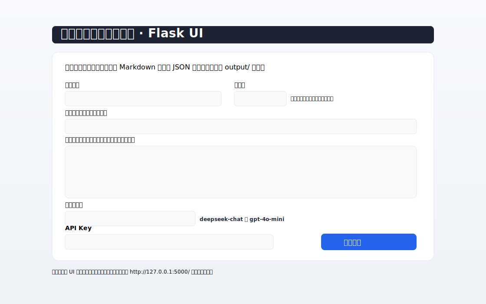

# Agent 教学文档生成器

一个基于 Flask 的简易 UI，用大模型一键生成课程教学大纲（Markdown）与教案数据（JSON）。

## 功能概览
- 表单填写后，生成两类产物并保存在 `output/` 目录：
  - `课程名称-教学大纲.md`
  - `课程名称-周数-data.json`（例如：`软件测试-18-data.json`）
- 支持输入：课程名称、总周数、排除项、教学大纲的功能说明（不作为排除项）、模型选择（DeepSeek 或 OpenAI）与 API Key。
- 支持输入：课程名称、总周数、排除项、教学大纲的功能说明（不作为排除项）、模型选择（DeepSeek 或 OpenAI）与 API Key。
- 同时提供“授课信息”面板（可选）：授课老师、授课地点、考核方式（默认：考察）、班级人数（1-99 的整数）、周学时（默认：4 学时/周）、授课时间（默认：1234节）。
- 自动处理“最后一周复习与综合提升”的建议：
  - 18 周时：固定“最后一周复习与综合提升”。
  - 20 周或其他周数：给出“最后一周复习与综合提升”的安排建议。
- API Key 仅在进程环境变量中使用，不会写入磁盘。

## 目录结构（关键）
```
agent/
├── UI/
│   ├── app.py                    # Flask 应用入口（Web 表单、生成与下载）
│   └── templates/
│       ├── index.html            # 表单页面（含功能说明、多模型、动态周数提示）
│       └── result.html           # 结果页（产物下载链接 + 运行日志）
├── build_course_docs.py          # 实际调用大模型生成大纲与教案的脚本
├── generate_syllabus.py          # 生成大纲的辅助脚本
├── templates/
│   ├── data_template.json        # 教案 JSON 模板
│   └── syllabus_template.md      # 教学大纲 Markdown 模板
├── requirements.txt              # 依赖清单
├── scripts/
│   ├── set-git-proxy.ps1         # 仓库级设置 Git 代理
│   └── unset-git-proxy.ps1       # 仓库级取消 Git 代理
└── output/                       # 生成结果（运行后出现）
```

## 安装依赖
建议使用本机 Python（或你的虚拟环境）执行：

```powershell
# 在项目根目录执行
pip install -r requirements.txt
```

## 启动 UI
默认端口 5000，可通过环境变量覆盖：

```powershell
# 方式一：使用系统 python（已安装依赖）
$env:PORT = "5000"        # 可改为 5001/5002...
python .\UI\app.py

# 方式二：指定虚拟环境 python 可执行文件
$env:PORT = "5001"
& "d:\Trae_Project\agent\VENV\agent-env\Scripts\python.exe" "d:\Trae_Project\agent\UI\app.py"
```

启动成功后访问：
- http://127.0.0.1:5000/（或你设置的端口）

## 使用说明
1. 打开表单页，填写：
   - 课程名称（必填）
   - 总周数（必填，18/20/其他均可，页面有动态提示）
   - 排除项（可空，逗号分隔）
   - 教学大纲的功能说明（可空，不作为排除项）
+  - 授课信息（可选）：
+    - 授课老师、授课地点
+    - 考核方式（默认“考察”）
+    - 班级人数（仅限 1-99 的整数，禁止字母与负数）
+    - 周学时（默认“4 学时/周”）
+    - 授课时间（默认“1234节”）
   - 大模型选择：DeepSeek（deepseek-chat）或 OpenAI（gpt-4o-mini）
   - API Key（必填）
2. 提交后，等待生成完成，跳转到结果页，点击链接下载文件。

说明：
- DeepSeek 模式下，会自动设置 `OPENAI_BASE_URL=https://api.deepseek.com`。
- Key 仅在子进程环境变量中使用，不会写入磁盘或日志。

## 命令行直接生成（可选）
无需 UI，直接用脚本生成：

```powershell
# 以 DeepSeek 为例
$env:OPENAI_API_KEY = "你的Key"
$env:DEEPSEEK_API_KEY = "你的Key"
$env:OPENAI_BASE_URL = "https://api.deepseek.com"
python .\build_course_docs.py --course "软件测试" --weeks 18 --model deepseek-chat --exclude "ChatGPT,生成代码" --features "强调项目驱动与实训"

# 以 OpenAI 为例（通常无需设置 OPENAI_BASE_URL）
$env:OPENAI_API_KEY = "你的Key"
python .\build_course_docs.py --course "软件测试" --weeks 18 --model gpt-4o-mini
```

生成后，产物位于 `output/`：
- `课程名称-教学大纲.md`
- `课程名称-周数-data.json`

也可通过 UI 下载接口：
- `GET /download/<filename>`（例如 `/download/软件测试-18-data.json`）

## 代理与推送（可选）
仓库已提供便捷脚本，仅影响当前仓库：

```powershell
# 设置仓库级代理（默认 127.0.0.1:10808）
.\scripts\set-git-proxy.ps1
# 或自定义端口
.\scripts\set-git-proxy.ps1 -Proxy "http://127.0.0.1:7890"

# 取消仓库级代理
.\scripts\unset-git-proxy.ps1
```

## 常见问题
- 端口占用：
  - 设置 `PORT`（或 `FLASK_RUN_PORT`）到其他端口后再启动。
- PowerShell 运行脚本被拦截：
  - 临时放行当前进程：`Set-ExecutionPolicy -Scope Process -ExecutionPolicy Bypass`
- 推送 GitHub 超时：
  - 使用上面的仓库级代理脚本，或在 Git 中设置全局/仓库代理。

## 文件命名规则摘要
- 大纲：`课程名称-教学大纲.md`
- 教案 JSON：`课程名称-周数-data.json`（示例：`软件测试-18-data.json`）

## 安全提示
- 不要将 API Key 写入代码或仓库。
- 仅在运行时通过环境变量传入，完成后可清除当前会话的环境变量。

---
如需进一步定制（UI 两列布局、更大输入区、模板个性化、接入更多模型等），欢迎提交 Issue 或 PR。

## UI 预览


## 环境变量清单与说明
| 变量名 | 是否必需 | 何时使用 | 示例值 | 说明 |
|---|---|---|---|---|
| OPENAI_API_KEY | 是（至少其一） | 所有模型 | sk-... | 与 DEEPSEEK_API_KEY 二选一，二者都提供时以 UI 选择的模型为准 |
| DEEPSEEK_API_KEY | 是（至少其一） | 选择 DeepSeek 时 | sk-... | 选择 DeepSeek 时将自动配置 base_url 指向 deepseek |
| OPENAI_BASE_URL | 否 | 需要自定义 OpenAI 兼容网关时 | https://api.deepseek.com | 若选择 DeepSeek，会自动设置为该地址；OpenAI 官方通常不需要设置 |
| LLM_BASE_URL | 否 | 备用 base_url 变量名 | http(s)://your-gateway | 若未设置 OPENAI_BASE_URL，会尝试读取该变量 |
| PORT | 否 | 启动 UI 时 | 5000/5001/5002 | 若未设置则默认 5000（也可用 FLASK_RUN_PORT） |
| FLASK_RUN_PORT | 否 | 启动 UI 时 | 5000/5001/5002 | 与 PORT 等价，任一生效即可 |

说明：
- 表单提交时，后端仅在子进程环境中注入 Key 与 base_url，不写入磁盘。
- 选择 DeepSeek 模型时，会自动设置 OPENAI_BASE_URL=https://api.deepseek.com。

## 贡献指南
- 分支策略
  - main：稳定可用的主分支
  - feature/*：功能开发分支，例如 feature/ui-tweaks、feature/azure-support
  - fix/*：缺陷修复分支，例如 fix/validate-weeks
- 提交信息规范（Conventional Commits）
  - feat: 新功能
  - fix: 修复缺陷
  - docs: 文档更新
  - chore: 杂项（构建脚本、依赖小升级等）
  - refactor: 重构（无功能变化）
  - test: 测试相关
  - build/ci: 构建或 CI 变更
  - revert: 回滚
  - 示例：
    - feat(ui): 扩大“功能说明”输入框尺寸，优化表单布局
    - fix(api): 校验周数输入并提示

## License
- 本项目采用 MIT 许可证。你可以在遵循许可条款的前提下自由使用、修改与分发。
- 详见仓库根目录的 LICENSE 文件。

## 更新记录

- feat(ui,backend): 写入“授课信息”到模板并生成《教案模板标记值-课程名.md》，在结果页提供下载链接（UI/app.py, UI/templates/result.html）。

## 使用说明补充

- 新增输出：在提交后会额外生成并输出文件：`教案模板标记值-课程名称.md`，位于 `output/` 目录。
- 内容来源：来自页面“授课信息”面板的字段值，模板基于 `templates/教案模板标记值.md` 替换以下占位符：
  - {授课科目}、{总周数}、{授课老师}、{班级人数}、{授课时间}、{周学时}、{考核方式}、{授课地点}
- 结果页将提供该 Markdown 文件的直接下载链接。